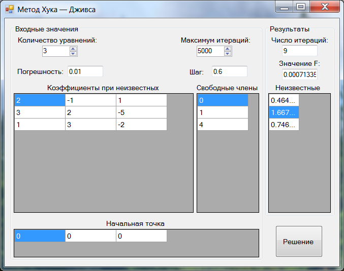

# Hooke_Jeeves_WinForms
Windows Forms Program (C++). Implementation of the minimization method for solving systems of linear equations. Provide for entering the number of equations (up to 10), the matrix of coefficients and the vector of free terms. For the solution use the Hook-Jeeves method.

